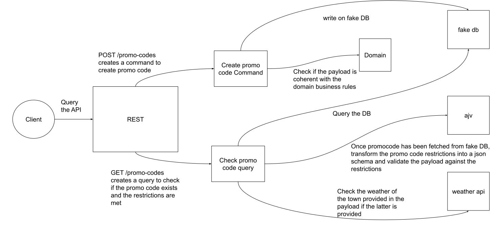

## Installation

```bash
$ npm install
```

## Setting openweather api key

Create a .env file in the root project directory (use the .env.example file)

```
OPENWEATHERMAP_API_KEY=YOU_API_KEY

```

## Running the app

```bash
# development
$ npm run start

# watch mode
$ npm run start:dev
```

Swagger is available at http://localhost:3000/api

Otherwise there are 2 endpoints:
- POST /localhost:3000/promo-codes to create a promo code
- GET /localhost:3000/promo-codes/check to check a promo code validity

## Test

```bash
$ npm run test


# test coverage
$ npm run test:cov
```

## technical stack:
- [Nestjs](https://nestjs.com/) frawmework 
- [class validator](https://github.com/typestack/class-validator): To validate the domain is valid 
- [ajv](https://ajv.js.org/): To transform the promocode restriction into a json schema that will be used upon requesting the validity of a promocode
- [openweathermap](https://openweathermap.org/) To handle geoloc and weather requests
- [axios](https://axios-http.com/fr/docs/intro) To handle http calls to openweathermap

##  Architecture



There is 3 mains modules in the codebase which is a lightweight version of Domain Driven Development
- The domain
- The Infrastructure 
- The REST adapter
  
### Domain module
-The codebase is domain oriented, which means that everything rotates around the entites that are defined in it. This means that entities that are created have been thought to be as close as possible as what the business wants. This ensure that regardless of how the data is stored or used (through other adapters) we can focus on having a valid representation of our objects (ie the promocode and the restrictions)
Below are the different entities found in the domain:

#### Promo code
A promo code is a code represented by a name (ie happy10), that once it has been redeemed, a discount is offered to the person who requested it (through what we call an advantage)

#### Advantage
An advantage is a discount percentage that is offered to a person if the promo code name is valid

#### Restriction
If one wants to restrict the usage of a promocode, it is possible to dot it trought a restriction

A restriction is a way to impose a rule to redeem a promo code 

There are currently 5 restrictions

##### Age
When used it is possible to impose either
- A minimum age
- A maximum age
- An age range
- An exact age
##### Weather
When used it is possible to impose
- A weather condition (ie Rain)
And either
- A minimum temperature
- A maximum temperature
- A temperature range
- An exact temperature
##### Date
When used it is possible to impose
- A start date
- An end date
- A date range
#### Or
When used it is now possible to declare a set of restrictions and the rule is that at least one of the restirctions must be met
#### And
When used it is now possible to declare a set of restrictions and the rule is that all of the restirctions must be met


### Infrastructure module
Within this module there are 3 subs module

#### fake DB module
This module is intented to simulate a DB, this is in fact a stateful service that is provided as a singleton through the whole application
The service starts with a promocode that already exists: "happy10"

#### ajv module
This module handles the workflow of ensuring the promocode's restrictions are respected.
There is one DTO called AjvRestiction which is responsibles of converting the restrictions domain into an ajv json schema. And a service that abstracts the ajv lib is also exposed.

#### weather-api module
this module is responsible of checking the weather of the town provided by the user

### CQRS
CQRS is used to separate everything that has a side effect (ie the promo code for our use case) and the rest that is purely read only (ie checking if a promo code is valid)

## Improvements

### Using a real DB 
The service was solely used to simplify the write/query parts of the data

### Better user friendly messages when a promocode restriction is not met
When using nested or/and, the error messages become harder to understand

### Using values object and aggregate root to define our entity
If we truly want to go deeper into DDD:
Promocode entity itself could be an aggregate root (since it is our main entry point). The ID could be an uuid (relying on a combination of the promocode name/restrictions/advantage could lead to potential issues in the future like what happens if someones only enters a promocode without restrictions, it would become impossible to reuse the promocode name..)
The rest could be values object (ie they only differs by their properties)

### Reduce calls to openweathermap api
Either store the data in a temporary space like a redis where the key would be the town requested to prevent spam calls to the GET /promo-codes/check endpoint or when multiples user of the same town use the endpoint.  That or we could also batch the calls of the same town through a [dataloader](https://www.npmjs.com/package/dataloader)


